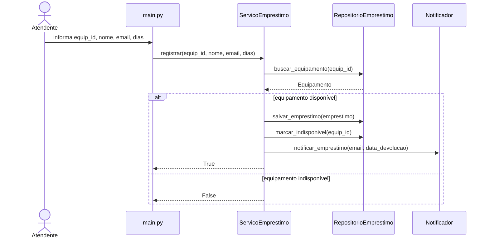

Decomposição em camadas

Classes principais e as razões em que estão em cada camada:

Abaixo estão as classes principais e a razão de estarem em cada camada:

* Equipamento (Camada de Modelos): Esta classe mora aqui porque representa o objeto central do domínio (como Notebook ou Projetor) e os seus dados básicos. Ela é independente de como os dados são salvos ou mostrados.

* RepositorioEmprestimo (Camada de Dados): Mora nesta camada para aplicar o ocultamento de informação. O resto do sistema não precisa de saber se os dados estão numa lista ou num banco de dados; apenas este repositório lida com isso.

* ServicoEmprestimo (Camada de Negócio): Esta é a camada onde moram as regras de negócio. Ela coordena as ações do sistema, como validar a disponibilidade de um item e calcular multas, ligando os modelos aos repositórios.

* Notificador (Camada de Infraestrutura): Mora aqui para isolar a comunicação externa. Seguindo o Princípio da Responsabilidade Única (SRP), se decidirmos mudar o aviso de e-mail para SMS, alteramos apenas esta classe sem mexer nas regras de empréstimo.

Bloco do diagrama 



Parte 2 — Diagramas de sequência
* UC02
  ```mermaid

    sequenceDiagram
    autonumber
    actor Atendente
    participant main as main.py (Visão)
    participant servico as ServicoEmprestimo (Negócio)
    participant repo as RepositorioEmprestimo (Dados)
    participant notif as Notificador (Infra)

    Atendente->>main: seleciona "2-Devolver" e informa ID
    activate main
    main->>servico: registrar_devolucao(emprestimo_id)
    activate servico
    
    servico->>repo: buscar_emprestimo_por_id(emprestimo_id)
    repo-->>servico: objeto Emprestimo
    
    alt Empréstimo existe e está ativo
        servico->>servico: calcular_multa(data_atual)
        servico->>repo: atualizar_status_devolucao(emprestimo_id)
        servico->>repo: liberar_equipamento(equip_id)
        servico->>notif: enviar_email_devolucao(email, multa)
        servico-->>main: Retorna dados da devolução (multa)
    else Empréstimo inválido ou já devolvido
        servico-->>main: Retorna Erro
    end
    
    deactivate servico
    main-->>Atendente: Exibe confirmação e valor da multa
    deactivate main

* UC03

  ```mermaid
  
    sequenceDiagram
    autonumber
    actor Coordenador
    participant main as main.py (Visão)
    participant servico as ServicoEmprestimo (Negócio)
    participant repo as RepositorioEmprestimo (Dados)
    participant notif as Notificador (Infra)

    Coordenador->>main: seleciona "3-Atrasados"
    activate main
    main->>servico: processar_atrasados()
    activate servico
    
    servico->>repo: obter_todos_emprestimos()
    repo-->>servico: lista_emprestimos
    
    loop Para cada emprestimo na lista
        servico->>servico: verificar_atraso(data_atual)
        alt Em atraso e não devolvido
            servico->>servico: calcular_multa_acumulada()
            servico->>notif: notificar_atraso_por_email(email)
            servico-->>main: envia dados do atrasado
        end
    end
    
    deactivate servico
    main-->>Coordenador: Exibe lista de atrasados ou "Nenhum atraso"
    deactivate main
